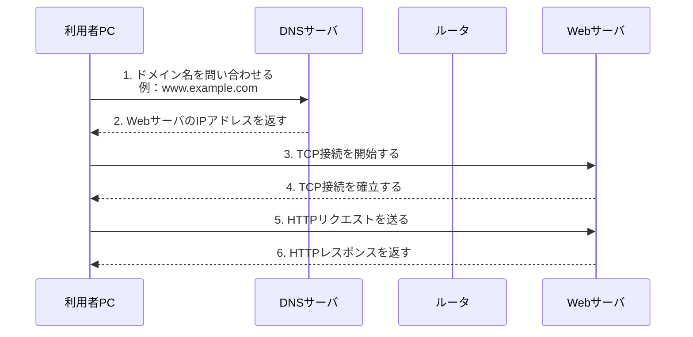
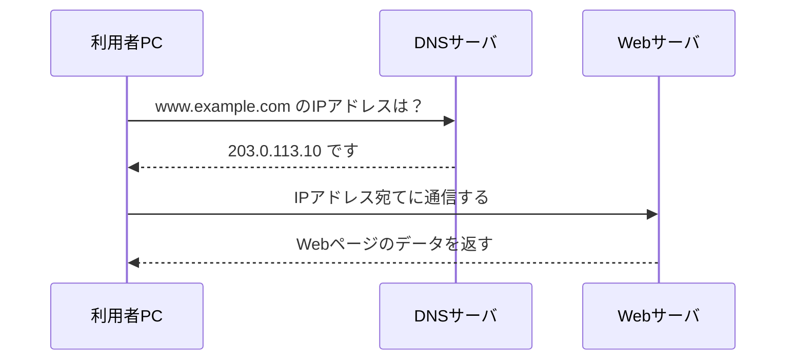
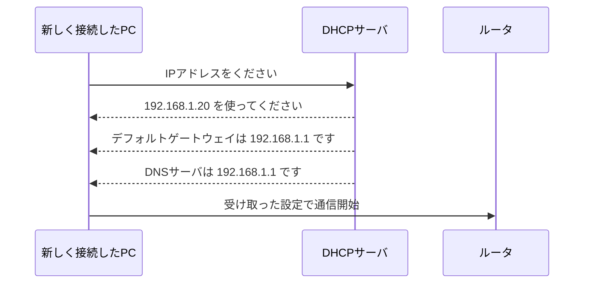
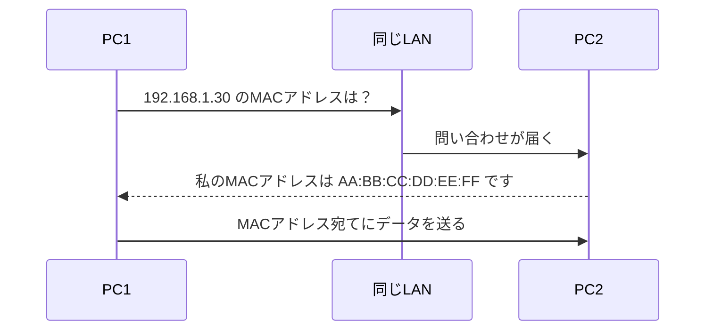
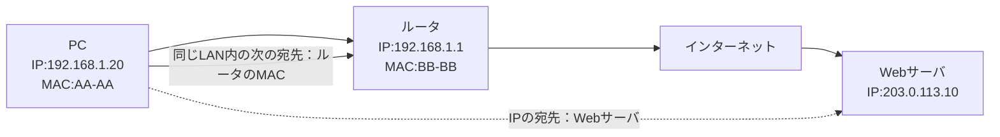
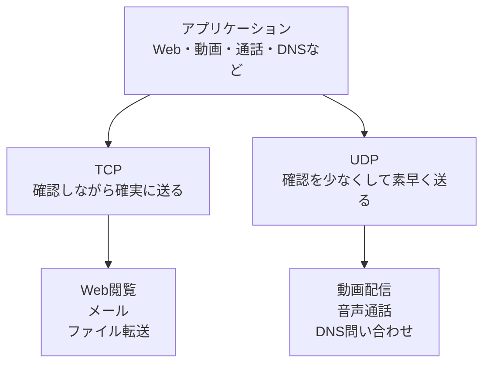
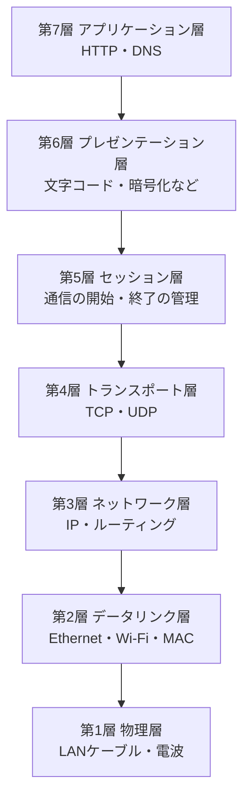
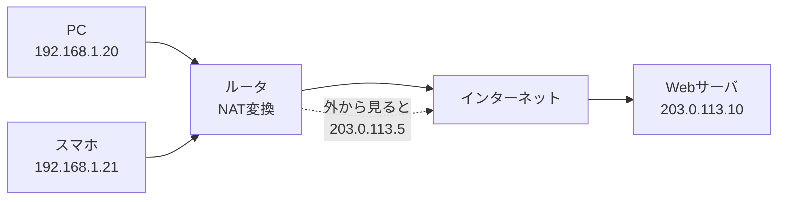

# ネットワーク初学者向け 学習教材

対象：基本情報技術者試験の合格を目指している初心者

この教材では、ネットワークを「用語の暗記」ではなく、「通信がどのように進むか」という流れで理解します。  
特に、Webページを見るときに、DNS、IPアドレス、TCP、HTTP、Ethernetがどのように関係するかを重視します。

---

## 学習の進め方

まずは全体像をつかみ、その後で個別の技術を学びます。  
いきなりOSI参照モデルから入ると抽象的で覚えにくいため、身近な家のWi-FiやWebページ閲覧から考えます。

---

## ファイル構成

1. [家庭・職場の基本的なネットワーク構成](01_basic_network.md)
2. [Webページを見るときの通信の流れ](02_web_access_flow.md)
3. [DNSの役割](03_dns.md)
4. [DHCPの役割](04_dhcp.md)
5. [ARPの役割](05_arp.md)
6. [ルータ・スイッチ・アクセスポイント・ファイアウォールの違い](06_devices.md)
7. [IPアドレスとMACアドレスの違い](07_ip_vs_mac.md)
8. [TCPとUDPの違い](08_tcp_udp.md)
9. [OSI参照モデルと実際の通信の対応](09_osi_model.md)
10. [NATとグローバルIP / プライベートIP](10_nat_ip.md)
11. [用語集](glossary.md)

---

## 学習のゴール

この教材を読み終えたとき、次の内容を説明できる状態を目指します。

- 家庭や職場のネットワークで、PC、スイッチ、ルータ、アクセスポイントが何をしているか
- Webページを見るとき、DNS、TCP、HTTPがどの順番で関係するか
- IPアドレスとMACアドレスの役割の違い
- TCPとUDPの使い分け
- OSI参照モデルが、実際の通信のどこに対応するか
- NATがなぜ必要なのか

---

## Mermaid図について

各ファイルには、Mermaid形式の図を入れています。  
Mermaidに対応したMarkdownエディタやGitHubに貼ると、図として表示できます。

表示できない環境でも、矢印とラベルを読めば、通信の流れは確認できます。


---

# 01 家庭・職場の基本的なネットワーク構成

## 何の図か

この図は、家や職場でPCがインターネットに接続するときの基本構成を示しています。  
まずは、「どの機器が、どの位置で働くのか」を理解します。


---

## 登場する機器や要素の役割

### 利用者PC・スマホ・タブレット
利用者がブラウザやアプリを使う端末です。  
ネットワーク通信の出発点になります。

### アクセスポイント
スマホやノートPCをWi-FiでLANにつなぐ機器です。  
家庭用Wi-Fiルータでは、アクセスポイント機能が一体になっていることが多いです。

### スイッチ
同じLAN内の機器をつなぐ機器です。  
スイッチは、主にMACアドレスを見て、同じネットワーク内でデータを届けます。

### ルータ
LANとインターネットなど、異なるネットワークをつなぐ機器です。  
ルータは、主にIPアドレスを見て、次にどこへ送るかを判断します。

### インターネット
世界中のネットワークがつながった大きなネットワークです。

### Webサーバ
Webページのデータを持っているコンピュータです。  
ブラウザからの要求に対して、HTMLや画像などを返します。

---

## 通信の流れ

たとえば家のWi-FiでWebページを見る場合、通信は次のように進みます。

1. 利用者PCが、Webサーバへ通信したいと判断します。
2. PCはWi-Fiを使ってアクセスポイントにデータを送ります。
3. アクセスポイントは、LAN内のスイッチやルータへデータを渡します。
4. ルータは、LANの外にあるWebサーバへ向けてデータを送ります。
5. インターネットを経由して、Webサーバにデータが届きます。
6. Webサーバは、応答データを同じように戻します。

---

## 初心者が混乱しやすいポイント

### ルータとスイッチは役割が違う
スイッチは、基本的に同じLAN内の機器をつなぎます。  
ルータは、LANとインターネットのように、異なるネットワークをつなぎます。

### 家庭用Wi-Fiルータは複数の機能を持つ
家庭用Wi-Fiルータは、実際には次の機能をまとめて持つことが多いです。

- ルータ
- スイッチ
- アクセスポイント
- DHCPサーバ
- NAT

そのため、1台の機器に見えても、中では複数の役割を担っています。

---

## 基本情報技術者試験での重要ポイント

試験では、機器名と役割の対応がよく問われます。

- スイッチ：同じLAN内で通信を中継する
- ルータ：異なるネットワーク間で通信を中継する
- アクセスポイント：無線LAN端末をネットワークに接続する
- ファイアウォール：通信を許可・遮断する
- DHCP：IPアドレスなどを自動配布する
- DNS：ドメイン名をIPアドレスに変換する

---

## 確認問題

1. スイッチは、主にどの範囲の通信を中継しますか。
2. ルータは、どのようなネットワーク同士をつなぎますか。
3. アクセスポイントの役割は何ですか。
4. 家庭用Wi-Fiルータが複数の機能を持つ理由を説明してください。
5. Webサーバは、利用者PCに対して何を返しますか。

### 解答例

1. 同じLAN内の通信を中継します。
2. LANとインターネットなど、異なるネットワーク同士をつなぎます。
3. Wi-Fi端末をネットワークに接続します。
4. 家庭では1台で通信に必要な機能をまとめると便利だからです。
5. HTML、画像、CSS、JavaScriptなどのWebページのデータを返します。


---

# 02 Webページを見るときの通信の流れ

## 何の図か

この図は、ブラウザでWebページを見るときに、通信がどのような順番で進むかを示しています。  
DNS、IPアドレス、TCP、HTTP、Ethernetの関係をまとめて理解するための中心テーマです。



---

## 登場する機器や要素の役割

### 利用者PC
ブラウザを使ってWebページを見ようとする端末です。  
通信の出発点になります。

### DNSサーバ
ドメイン名に対応するIPアドレスを教えるサーバです。  
たとえば `www.example.com` のような名前を、通信に使えるIPアドレスへ変換します。

### ルータ
PCから出た通信を、インターネット側へ中継します。  
図では省略していますが、DNSサーバやWebサーバへ向かう途中で通信を運びます。

### Webサーバ
Webページのデータを持っているサーバです。  
ブラウザからのHTTPリクエストに対して、HTTPレスポンスを返します。

---

## 通信の流れ

Webページを見るときは、いきなりHTTP通信だけが始まるわけではありません。  
まず、相手の場所を調べる処理が必要です。

### 1. 利用者がURLを入力する
利用者がブラウザにURLを入力します。  
例として、`https://www.example.com` にアクセスするとします。

### 2. DNSでIPアドレスを調べる
PCは、`www.example.com` という名前だけでは通信できません。  
そこで、DNSサーバに「この名前のIPアドレスは何ですか」と問い合わせます。

### 3. DNSサーバがIPアドレスを返す
DNSサーバは、WebサーバのIPアドレスをPCに返します。  
これでPCは、通信相手の住所にあたるIPアドレスを知ることができます。

### 4. TCPで通信の準備をする
Webページを見る場合、多くはHTTPまたはHTTPSを使います。  
HTTP/HTTPSでは、通信の信頼性を確保するためにTCPが使われることが一般的です。

TCPは、データを送る前に「これから通信してよいか」を確認します。  
この接続準備を、TCP接続の確立といいます。

### 5. HTTPリクエストを送る
TCP接続ができた後、PCのブラウザはWebサーバにHTTPリクエストを送ります。  
これは「このページをください」という依頼です。

### 6. HTTPレスポンスが返る
Webサーバは、HTMLや画像などをHTTPレスポンスとして返します。  
ブラウザは受け取ったデータを画面に表示します。

---

## DNS、IP、TCP、HTTP、Ethernetの関係

Web通信は、役割ごとに見ると理解しやすくなります。

| 用語 | 役割 | たとえるなら |
|---|---|---|
| DNS | 名前からIPアドレスを調べる | 電話帳・住所録 |
| IP | 相手のネットワーク上の住所を示す | 住所 |
| TCP | 確実に届くように通信を管理する | 配送確認付きの配達 |
| HTTP | Webページをください、と依頼する約束 | 注文内容 |
| Ethernet | 同じLAN内で実際にデータを運ぶ | 近所内の配送 |

重要なのは、これらが競合するものではなく、役割分担していることです。

---

## OSI参照モデルとの対応

Webページを見る通信をOSI参照モデルに対応させると、概ね次のように整理できます。

| OSI層 | 関係する技術 | 役割 |
|---|---|---|
| 第7層 アプリケーション層 | HTTP、DNS | 利用者に近い処理を行う |
| 第4層 トランスポート層 | TCP | 通信の信頼性を管理する |
| 第3層 ネットワーク層 | IP | 異なるネットワークへ届ける |
| 第2層 データリンク層 | Ethernet、Wi-Fi、MACアドレス | 同じLAN内で届ける |
| 第1層 物理層 | LANケーブル、電波 | 物理的な信号を送る |

---

## 初心者が混乱しやすいポイント

### 「HTTPが先」ではなく、「利用者の目的がHTTP」
利用者の目的は、Webページを見ることです。  
そのため、最終的にはHTTPでページを要求します。

しかし、実際の通信では、HTTPリクエストを送る前にDNSでIPアドレスを調べたり、TCP接続を確立したりします。

### DNSとHTTPはどちらもアプリケーション層
DNSもHTTPも、OSI参照モデルではアプリケーション層に分類されます。  
ただし、役割は違います。

- DNS：名前をIPアドレスに変換する
- HTTP：Webページを要求・取得する

### IPアドレスだけでは同じLAN内の配送ができない
IPアドレスは、通信相手のネットワーク上の住所です。  
一方、同じLAN内で実際に機器へ届けるときには、MACアドレスが使われます。

---

## 基本情報技術者試験での重要ポイント

試験では、次の流れを説明できると強いです。

1. URLを入力する
2. DNSでIPアドレスを調べる
3. TCPで接続を確立する
4. HTTPでページを要求する
5. Webサーバがデータを返す
6. IPやEthernetにより、データが各区間で運ばれる

特に、DNS、TCP、HTTPの順番が混ざりやすいので注意します。

---

## 確認問題

1. Webページを見るとき、DNSは何を調べますか。
2. HTTPリクエストは、何を依頼する通信ですか。
3. TCPは、Web通信の中でどのような役割を持ちますか。
4. IPアドレスとMACアドレスは、それぞれどの場面で使われますか。
5. DNS、TCP、HTTPを通信の流れに沿って並べてください。

### 解答例

1. ドメイン名に対応するIPアドレスを調べます。
2. Webページなどのデータをサーバへ要求します。
3. データを正しく届けるために、接続や再送などを管理します。
4. IPアドレスはネットワークを越えて相手を指定するときに使い、MACアドレスは同じLAN内で機器を指定するときに使います。
5. DNSでIPアドレスを調べる、TCPで接続する、HTTPでページを要求する、という順番です。


---

# 03 DNSの役割

## 何の図か

この図は、DNSがドメイン名をIPアドレスに変換する流れを示しています。  
DNSは、Web通信の前準備として重要です。



---

## 登場する機器や要素の役割

### ドメイン名
人間が覚えやすい名前です。  
例：`www.example.com`

### IPアドレス
コンピュータ同士が通信するときに使う住所です。  
例：`203.0.113.10`

### DNSサーバ
ドメイン名に対応するIPアドレスを教えるサーバです。  
人間向けの名前と、コンピュータ向けの住所を結びつけます。

---

## 通信の流れ

1. 利用者がブラウザにURLを入力します。
2. PCは、ドメイン名だけでは通信できないため、DNSサーバに問い合わせます。
3. DNSサーバは、対応するIPアドレスを返します。
4. PCは、そのIPアドレス宛てに通信を始めます。
5. Webサーバは、Webページのデータを返します。

---

## 初心者が混乱しやすいポイント

### DNSはWebページを返すサーバではない
DNSサーバは、Webページ本体を返しません。  
DNSサーバが返すのは、基本的にはIPアドレスです。

### ドメイン名とURLは同じではない
URLは、Web上の場所を示す全体の表記です。  
ドメイン名は、その中のサーバ名にあたる部分です。

例：

```text
https://www.example.com/index.html
```

- `https`：通信方式
- `www.example.com`：ドメイン名
- `/index.html`：ページの場所

### DNSは毎回必ず外部へ問い合わせるとは限らない
PCやブラウザ、ルータなどが過去の結果を一時的に覚えている場合があります。  
この仕組みをキャッシュといいます。

---

## 基本情報技術者試験での重要ポイント

DNSは、「ドメイン名とIPアドレスを対応付ける仕組み」としてよく問われます。  
選択肢で「名前解決」という言葉が出たら、DNSを思い出します。

- DNS：名前解決
- DHCP：IPアドレスの自動配布
- ARP：IPアドレスからMACアドレスを調べる

この3つは混同しやすいため、役割の違いで覚えます。

---

## 確認問題

1. DNSは何を何に変換しますか。
2. DNSサーバは、Webページ本体を返しますか。
3. `https://www.example.com/index.html` のうち、ドメイン名はどの部分ですか。
4. DNSの結果を一時的に保存する仕組みを何といいますか。
5. DNS、DHCP、ARPの役割をそれぞれ一言で説明してください。

### 解答例

1. ドメイン名をIPアドレスに変換します。
2. 返しません。基本的にはIPアドレスを返します。
3. `www.example.com` です。
4. キャッシュです。
5. DNSは名前解決、DHCPはIPアドレスの自動配布、ARPはIPアドレスからMACアドレスを調べる仕組みです。


---

# 04 DHCPの役割

## 何の図か

この図は、PCやスマホがネットワークに接続したとき、自動的にIPアドレスなどを受け取る流れを示しています。  
DHCPは、端末のネットワーク設定を自動化する仕組みです。



---

## 登場する機器や要素の役割

### DHCPクライアント
IPアドレスなどの設定を受け取る端末です。  
PC、スマホ、タブレットなどが該当します。

### DHCPサーバ
IPアドレスなどを自動で配布するサーバです。  
家庭では、Wi-FiルータがDHCPサーバの役割を持つことが多いです。

### デフォルトゲートウェイ
LANの外へ出るときに使う出口です。  
通常はルータのIPアドレスです。

### DNSサーバ
ドメイン名をIPアドレスに変換するときに使うサーバです。  
DHCPでは、DNSサーバの情報も一緒に配布されることがあります。

---

## 通信の流れ

1. PCがWi-FiやLANケーブルでネットワークに接続します。
2. PCは、自分が使うIPアドレスをまだ持っていません。
3. PCは、DHCPサーバに設定情報を要求します。
4. DHCPサーバは、使用可能なIPアドレスをPCに割り当てます。
5. DHCPサーバは、必要に応じてデフォルトゲートウェイやDNSサーバも通知します。
6. PCは、受け取った設定を使って通信を始めます。

---

## 初心者が混乱しやすいポイント

### DHCPはDNSとは違う
DHCPは、IPアドレスなどを端末へ配布する仕組みです。  
DNSは、ドメイン名をIPアドレスに変換する仕組みです。

### DHCPはIPアドレスを「決める」仕組み
PCがネットワークに入ったとき、IPアドレスが重複しないように割り当てます。  
これにより、利用者が手作業でIPアドレスを設定しなくても済みます。

### 固定IPアドレスとは違う
DHCPでは、IPアドレスが自動で割り当てられます。  
一方、固定IPアドレスでは、管理者が端末に手動でIPアドレスを設定します。

---

## 基本情報技術者試験での重要ポイント

DHCPは、「IPアドレスを自動的に割り当てるプロトコル」として出題されます。  
また、DHCPで配布される情報として、次のものを押さえます。

- IPアドレス
- サブネットマスク
- デフォルトゲートウェイ
- DNSサーバ

---

## 確認問題

1. DHCPは何を自動的に配布しますか。
2. 家庭では、どの機器がDHCPサーバの役割を持つことが多いですか。
3. デフォルトゲートウェイとは何ですか。
4. DHCPとDNSの違いを説明してください。
5. DHCPで配布される代表的な情報を2つ挙げてください。

### 解答例

1. IPアドレスなどのネットワーク設定を配布します。
2. 家庭用Wi-Fiルータです。
3. LANの外へ通信するときに使う出口です。
4. DHCPはIPアドレスなどを配布し、DNSはドメイン名をIPアドレスに変換します。
5. IPアドレス、サブネットマスク、デフォルトゲートウェイ、DNSサーバなどです。


---

# 05 ARPの役割

## 何の図か

この図は、同じLAN内で、IPアドレスからMACアドレスを調べる流れを示しています。  
ARPは、IP通信を実際のLAN内配送につなげるための仕組みです。



---

## 登場する機器や要素の役割

### IPアドレス
ネットワーク上の住所です。  
どのネットワークにいる相手かを判断するために使います。

### MACアドレス
ネットワーク機器ごとに割り当てられた識別番号です。  
同じLAN内で機器を特定するために使います。

### ARP
IPアドレスからMACアドレスを調べる仕組みです。  
同じLAN内で相手にデータを届けるために必要です。

---

## 通信の流れ

1. PC1は、同じLAN内のPC2へ通信したいと考えます。
2. PC1は、PC2のIPアドレスを知っています。
3. しかし、同じLAN内で実際に届けるにはMACアドレスが必要です。
4. PC1は、ARPで「このIPアドレスを持っている機器は誰ですか」と問い合わせます。
5. PC2は、自分のMACアドレスをPC1へ返します。
6. PC1は、取得したMACアドレス宛てにデータを送ります。

---

## 初心者が混乱しやすいポイント

### IPアドレスだけでは最後の配送ができない
IPアドレスは、ネットワーク上の住所として使われます。  
ただし、同じLAN内で実際にフレームを届けるときには、MACアドレスが必要です。

### ARPは同じLAN内で使う
ARPは、基本的に同じLAN内で相手のMACアドレスを調べる仕組みです。  
遠くのWebサーバのMACアドレスを直接調べるわけではありません。

### ルータを越えるとMACアドレスは変わる
IPアドレスは通信の最終目的地を示します。  
一方、MACアドレスは次に届ける相手を示します。  
ルータを越えるたびに、次の区間で使うMACアドレスは変わります。

---

## 基本情報技術者試験での重要ポイント

ARPは、「IPアドレスからMACアドレスを得るプロトコル」として出題されます。  
DNSやDHCPと混同しないようにします。

- DNS：ドメイン名 → IPアドレス
- DHCP：IPアドレスなどを自動配布
- ARP：IPアドレス → MACアドレス

---

## 確認問題

1. ARPは何を何に対応付けますか。
2. MACアドレスは、主にどの範囲で使われますか。
3. 遠くのWebサーバのMACアドレスを、PCが直接ARPで調べますか。
4. ルータを越えると、MACアドレスの扱いはどうなりますか。
5. DNS、DHCP、ARPの違いを説明してください。

### 解答例

1. IPアドレスからMACアドレスを調べます。
2. 同じLAN内で使われます。
3. 通常は直接調べません。次に送る相手、たとえばルータのMACアドレスを使います。
4. ルータを越えるたびに、次の区間で使うMACアドレスが変わります。
5. DNSは名前解決、DHCPは設定の自動配布、ARPはIPアドレスからMACアドレスを調べる仕組みです。


---

# 06 ルータ・スイッチ・アクセスポイント・ファイアウォールの違い

## 何の図か

この図は、ネットワーク機器の役割の違いを示しています。  
機器名を暗記するのではなく、「どこで何を判断するか」で理解します。


---

## 登場する機器や要素の役割

### アクセスポイント
無線LAN端末をネットワークに接続します。  
スマホやタブレットがWi-Fiにつながる入口です。

### スイッチ
同じLAN内の機器を接続します。  
主にMACアドレスを使って、どのポートへデータを送るか判断します。

### ルータ
異なるネットワーク同士を接続します。  
主にIPアドレスを使って、次にどこへ送るか判断します。

### ファイアウォール
通信を許可するか、遮断するかを判断します。  
不正アクセスや不要な通信を防ぐために使います。

---

## 通信の流れ

1. スマホやPCは、アクセスポイントを通じてLANに入ります。
2. LAN内では、スイッチが機器同士の通信を中継します。
3. LANの外へ出る通信は、ルータへ向かいます。
4. ファイアウォールは、通信内容や宛先を見て、許可・遮断を判断します。
5. 許可された通信は、インターネットへ送られます。

---

## 初心者が混乱しやすいポイント

### 家庭用ルータは名前と実態がずれやすい
「Wi-Fiルータ」と呼ばれる機器には、実際には複数の機能が入っています。

- ルータ
- スイッチ
- アクセスポイント
- ファイアウォール
- DHCP
- NAT

そのため、学習では機器そのものではなく、機能ごとに分けて考えると理解しやすくなります。

### ルータとスイッチの違い
スイッチは同じLAN内をつなぎます。  
ルータは異なるネットワークをつなぎます。

### ファイアウォールは通信を中継するだけではない
ファイアウォールは、通信を通してよいか判断します。  
単なる通り道ではなく、門番の役割を持ちます。

---

## 基本情報技術者試験での重要ポイント

試験では、次の対応を押さえると解きやすくなります。

| 機器 | 主な役割 | 関係しやすい層 |
|---|---|---|
| スイッチ | 同じLAN内の中継 | データリンク層 |
| ルータ | 異なるネットワーク間の中継 | ネットワーク層 |
| アクセスポイント | 無線LAN接続 | データリンク層・物理層 |
| ファイアウォール | 通信の許可・遮断 | 複数層に関係する |

---

## 確認問題

1. スイッチは主に何を見て中継先を判断しますか。
2. ルータは主に何を見て中継先を判断しますか。
3. アクセスポイントの役割は何ですか。
4. ファイアウォールの役割は何ですか。
5. 家庭用Wi-Fiルータに複数の機能が入っている例を3つ挙げてください。

### 解答例

1. MACアドレスです。
2. IPアドレスです。
3. 無線LAN端末をネットワークに接続することです。
4. 通信を許可・遮断することです。
5. ルータ、スイッチ、アクセスポイント、DHCP、NAT、ファイアウォールなどです。


---

# 07 IPアドレスとMACアドレスの違い

## 何の図か

この図は、IPアドレスとMACアドレスの役割の違いを示しています。  
IPアドレスは最終的な宛先を考えるために使い、MACアドレスは同じLAN内の次の相手へ届けるために使います。



---

## 登場する要素の役割

### IPアドレス
ネットワーク上の住所です。  
通信相手がどのネットワークにいるかを判断するために使います。

### MACアドレス
ネットワーク機器ごとの識別番号です。  
同じLAN内で、次にどの機器へ届けるかを判断するために使います。

### ルータ
異なるネットワークへ通信を中継します。  
PCがインターネットへ出るとき、まずルータへデータを渡します。

---

## 通信の流れ

Webサーバへ通信する場合を考えます。

1. PCは、WebサーバのIPアドレスを宛先として考えます。
2. WebサーバはLANの外にいるため、PCはルータへデータを渡します。
3. 同じLAN内でルータへ届けるために、PCはルータのMACアドレスを使います。
4. ルータは、次のネットワークへデータを送ります。
5. このとき、IPアドレスは最終宛先を示し続けます。
6. 一方、MACアドレスは区間ごとに変わります。

---

## 初心者が混乱しやすいポイント

### IPアドレスとMACアドレスはどちらか一方だけではない
IPアドレスとMACアドレスは、役割が違います。  
ネットワーク通信では、両方が使われます。

### IPアドレスは「最終目的地」を考える
IPアドレスは、遠くのネットワークにいる相手も表せます。  
Webサーバのように、インターネット上の相手を指定できます。

### MACアドレスは「次に渡す相手」を考える
MACアドレスは、同じLAN内の配送に使います。  
遠くのWebサーバへ直接届けるのではなく、まずルータへ届けるために使います。

---

## 基本情報技術者試験での重要ポイント

試験では、次のように整理します。

| 項目 | IPアドレス | MACアドレス |
|---|---|---|
| 主な役割 | ネットワーク上の住所 | 機器の識別番号 |
| 主に使う範囲 | ネットワークを越えた通信 | 同じLAN内 |
| 関係する層 | ネットワーク層 | データリンク層 |
| 例 | 192.168.1.20 | AA:BB:CC:DD:EE:FF |

---

## 確認問題

1. IPアドレスは、主に何を示しますか。
2. MACアドレスは、主にどの範囲で使われますか。
3. PCがインターネット上のWebサーバへ通信するとき、同じLAN内ではまず誰のMACアドレスを使いますか。
4. IPアドレスはOSI参照モデルのどの層に関係しますか。
5. MACアドレスはOSI参照モデルのどの層に関係しますか。

### 解答例

1. ネットワーク上の住所を示します。
2. 同じLAN内で使われます。
3. ルータのMACアドレスを使います。
4. ネットワーク層です。
5. データリンク層です。


---

# 08 TCPとUDPの違い

## 何の図か

この図は、TCPとUDPの違いを示しています。  
TCPは信頼性を重視し、UDPは速さや軽さを重視します。



---

## 登場する要素の役割

### TCP
データが正しく届くことを重視する通信方式です。  
届かなかったデータを再送したり、順番を整えたりします。

### UDP
軽くて速い通信方式です。  
TCPほど細かい確認をしないため、リアルタイム性が必要な通信に向いています。

### アプリケーション
Webブラウザ、動画アプリ、通話アプリなどです。  
アプリケーションの性質によって、TCPとUDPのどちらを使うかが変わります。

---

## 通信の流れ

### TCPの場合
1. 送信側と受信側が、通信の準備をします。
2. データを順番に送ります。
3. 受信側は、届いたことを返事します。
4. 届かなかったデータがあれば、送信側が再送します。
5. 受信側は、順番を整えてアプリケーションへ渡します。

### UDPの場合
1. 送信側は、必要なデータをすぐに送ります。
2. TCPのような細かい確認は基本的に行いません。
3. 多少の欠けがあっても、速度を優先します。

---

## 初心者が混乱しやすいポイント

### TCPは必ず遅い、UDPは必ず速い、ではない
一般的には、TCPは確認が多く、UDPは軽いと理解します。  
ただし、実際の速度はネットワーク環境やアプリケーションの作りにも左右されます。

### UDPは「雑」ではなく、目的が違う
UDPは、信頼性を捨てているのではありません。  
必要な確認をアプリケーション側で行う場合もあります。

### Web通信でもUDPが使われることがある
従来のHTTP/HTTPSはTCPを使うことが多いです。  
一方で、HTTP/3ではQUICという仕組みが使われ、これはUDPの上で動きます。  
基本情報の学習では、まず「HTTPはTCPと結びつきやすい」と理解して問題ありません。

---

## 基本情報技術者試験での重要ポイント

試験では、TCPとUDPの特徴の違いがよく問われます。

| 項目 | TCP | UDP |
|---|---|---|
| 信頼性 | 高い | TCPより低い |
| 確認応答 | ある | 基本的に少ない |
| 再送制御 | ある | 基本的にない |
| 速度・軽さ | UDPより重い | 軽い |
| 用途 | Web、メール、ファイル転送 | DNS、動画、音声通話 |

---

## 確認問題

1. TCPが重視するものは何ですか。
2. UDPが重視するものは何ですか。
3. TCPでは、届かなかったデータに対して何が行われますか。
4. UDPが向いている通信の例を2つ挙げてください。
5. TCPとUDPは、OSI参照モデルのどの層に関係しますか。

### 解答例

1. 信頼性です。
2. 速さや軽さです。
3. 再送が行われます。
4. DNS問い合わせ、動画配信、音声通話などです。
5. トランスポート層です。


---

# 09 OSI参照モデルと実際の通信の対応

## 何の図か

この図は、OSI参照モデルの各層が、Webページを見る通信のどこに対応するかを示しています。  
OSI参照モデルは抽象的なので、実際の通信と結びつけて覚えます。



---

## 登場する層の役割

### 第7層 アプリケーション層
利用者に近い通信ルールです。  
HTTPやDNSが該当します。

### 第6層 プレゼンテーション層
データの表現形式を扱います。  
文字コード、圧縮、暗号化などが関係します。

### 第5層 セッション層
通信の開始、維持、終了などを扱います。  
基本情報では深く問われにくいですが、「会話のまとまりを管理する層」と考えます。

### 第4層 トランスポート層
アプリケーション間の通信を管理します。  
TCPやUDPが該当します。

### 第3層 ネットワーク層
異なるネットワークへデータを届けます。  
IPアドレスやルータが関係します。

### 第2層 データリンク層
同じLAN内でデータを届けます。  
MACアドレス、Ethernet、スイッチが関係します。

### 第1層 物理層
電気信号、光信号、電波などを扱います。  
LANケーブルや無線の電波が関係します。

---

## Web通信との対応

Webページを見る場合、利用者の操作から実際の信号まで、次のように階層化されます。

1. ブラウザがHTTPリクエストを作ります。
2. 必要に応じて、DNSでIPアドレスを調べます。
3. TCPが、通信の信頼性を管理します。
4. IPが、目的地のネットワークへ届けるための情報を付けます。
5. EthernetやWi-Fiが、同じLAN内で次の機器へ届けます。
6. 最後は、LANケーブルの信号や無線の電波として送られます。

---

## 初心者が混乱しやすいポイント

### 数字が小さいほど、物理的な通信に近い
第1層はLANケーブルや電波に近い層です。  
第7層はブラウザやアプリに近い層です。

### OSI参照モデルは「実物の機械」ではない
OSI参照モデルは、通信を理解するための考え方です。  
1台の機器の中で、複数の層の処理が行われます。

### 上から下へ包まれて送られ、下から上へ取り出される
送信側では、アプリケーションのデータが下位層に向かって包まれていきます。  
受信側では、下位層から上位層へ向かって取り出されます。

---

## 基本情報技術者試験での重要ポイント

試験では、層と代表的な技術の対応が重要です。

| OSI層 | 代表例 | 覚え方 |
|---|---|---|
| 第7層 | HTTP、DNS | アプリに近い |
| 第4層 | TCP、UDP | 通信の性質を決める |
| 第3層 | IP、ルータ | ネットワークを越える |
| 第2層 | Ethernet、MAC、スイッチ | 同じLAN内 |
| 第1層 | ケーブル、電波 | 物理的な信号 |

まずは、第7層、第4層、第3層、第2層、第1層を押さえます。  
第5層と第6層は、基本情報では代表例を軽く確認する程度でも構いません。

---

## 確認問題

1. OSI参照モデルで、HTTPやDNSが関係する層はどこですか。
2. TCPやUDPが関係する層はどこですか。
3. IPやルータが関係する層はどこですか。
4. MACアドレスやスイッチが関係する層はどこですか。
5. 数字が小さい層ほど、何に近いと考えるとよいですか。

### 解答例

1. 第7層 アプリケーション層です。
2. 第4層 トランスポート層です。
3. 第3層 ネットワーク層です。
4. 第2層 データリンク層です。
5. 物理的な通信に近いと考えます。


---

# 10 NATとグローバルIP / プライベートIP

## 何の図か

この図は、家の中のプライベートIPアドレスが、ルータでグローバルIPアドレスに変換されてインターネットへ出ていく流れを示しています。  
NATは、家庭や職場のネットワークでよく使われる重要な仕組みです。



---

## 登場する要素の役割

### プライベートIPアドレス
家庭や職場など、内部ネットワークで使うIPアドレスです。  
例：`192.168.1.20`

### グローバルIPアドレス
インターネット上で一意に使われるIPアドレスです。  
外部のサーバと通信するときに使われます。

### NAT
プライベートIPアドレスとグローバルIPアドレスを変換する仕組みです。  
家庭用ルータがNATを行うことが多いです。

### ルータ
内部ネットワークとインターネットの間に立ち、NAT変換を行います。

---

## 通信の流れ

1. PCは、プライベートIPアドレスを使っています。
2. PCがインターネット上のWebサーバへ通信しようとします。
3. ルータは、PCのプライベートIPアドレスを、自分のグローバルIPアドレスに変換します。
4. Webサーバから見ると、通信元はルータのグローバルIPアドレスに見えます。
5. Webサーバが応答を返すと、ルータは元のPCへ戻すように変換します。
6. PCは、Webサーバからの応答を受け取ります。

---

## 初心者が混乱しやすいポイント

### 家の中のIPアドレスは、インターネット全体で一意ではない
`192.168.x.x` のようなアドレスは、多くの家庭や職場で使われています。  
そのままではインターネット上の一意な住所としては使えません。

### 外から見ると、家の中の端末は同じIPに見えることがある
PCもスマホも、外部のWebサーバから見ると、同じルータのグローバルIPアドレスから来たように見えることがあります。

### NATは「変換表」を使って戻り先を覚える
ルータは、どの内部端末がどの通信を始めたかを記録しています。  
そのため、Webサーバから戻ってきた応答を、正しいPCやスマホへ返せます。

---

## 基本情報技術者試験での重要ポイント

試験では、NATは次のように問われます。

- プライベートIPアドレスをグローバルIPアドレスに変換する
- 複数の内部端末が、1つのグローバルIPアドレスを共有できる
- IPv4アドレスの不足対策として使われる

また、プライベートIPアドレスの代表例として、次の範囲も押さえます。

- `10.0.0.0` ～ `10.255.255.255`
- `172.16.0.0` ～ `172.31.255.255`
- `192.168.0.0` ～ `192.168.255.255`

---

## 確認問題

1. プライベートIPアドレスは、主にどこで使われますか。
2. グローバルIPアドレスは、どこで一意に使われますか。
3. NATは何を何に変換しますか。
4. 家のPCとスマホが、外部から同じIPアドレスに見えることがある理由を説明してください。
5. NATがIPv4アドレス不足対策になる理由を説明してください。

### 解答例

1. 家庭や職場などの内部ネットワークで使われます。
2. インターネット上で一意に使われます。
3. プライベートIPアドレスとグローバルIPアドレスを変換します。
4. ルータが複数端末の通信を1つのグローバルIPアドレスに変換するためです。
5. 複数の端末が1つのグローバルIPアドレスを共有できるためです。


---

# 用語集

## ARP
IPアドレスからMACアドレスを調べる仕組みです。  
同じLAN内で相手へデータを届けるために使います。

## DHCP
端末にIPアドレスなどのネットワーク設定を自動で配布する仕組みです。  
家庭ではWi-FiルータがDHCPサーバの役割を持つことが多いです。

## DNS
ドメイン名をIPアドレスに変換する仕組みです。  
「名前解決」ともいいます。

## Ethernet
有線LANなどで使われる通信方式です。  
OSI参照モデルでは主にデータリンク層に関係します。

## HTTP
WebブラウザとWebサーバがデータをやり取りするための通信ルールです。  
Webページを要求したり、返したりするときに使います。

## HTTPS
HTTPを安全に使うため、暗号化を加えた通信方式です。

## IP
ネットワークを越えて相手へデータを届けるための仕組みです。  
IPアドレスを使って宛先を判断します。

## IPアドレス
ネットワーク上の住所です。  
例：`192.168.1.20`

## LAN
家庭や職場など、比較的狭い範囲のネットワークです。

## MACアドレス
ネットワーク機器ごとの識別番号です。  
同じLAN内で機器を特定するために使います。

## NAT
プライベートIPアドレスとグローバルIPアドレスを変換する仕組みです。  
家庭用ルータでよく使われます。

## OSI参照モデル
ネットワーク通信を7つの層に分けて整理する考え方です。  
通信を理解するためのモデルです。

## TCP
信頼性を重視する通信方式です。  
データの到達確認や再送制御を行います。

## UDP
速さや軽さを重視する通信方式です。  
DNS問い合わせ、動画、音声通話などで使われます。

## Webサーバ
Webページのデータを持ち、ブラウザからの要求に応答するサーバです。

## アクセスポイント
スマホやノートPCなどをWi-Fiでネットワークに接続する機器です。

## キャッシュ
一度取得した情報を一時的に保存して、次回以降の処理を速くする仕組みです。  
DNSの結果もキャッシュされることがあります。

## グローバルIPアドレス
インターネット上で一意に使われるIPアドレスです。

## サブネットマスク
IPアドレスのうち、ネットワーク部分とホスト部分を区別するための情報です。

## スイッチ
同じLAN内の機器を接続する機器です。  
主にMACアドレスを見て通信を中継します。

## デフォルトゲートウェイ
LANの外へ通信するときの出口です。  
通常はルータのIPアドレスです。

## ドメイン名
人間が覚えやすいサーバ名です。  
例：`www.example.com`

## ファイアウォール
通信を許可したり遮断したりする仕組みです。  
ネットワークの門番のような役割です。

## プライベートIPアドレス
家庭や職場などの内部ネットワークで使うIPアドレスです。  
例：`192.168.1.20`

## プロトコル
通信の約束事です。  
HTTP、TCP、IP、DNSなどが該当します。

## ルータ
異なるネットワーク同士を接続する機器です。  
主にIPアドレスを見て通信を中継します。
